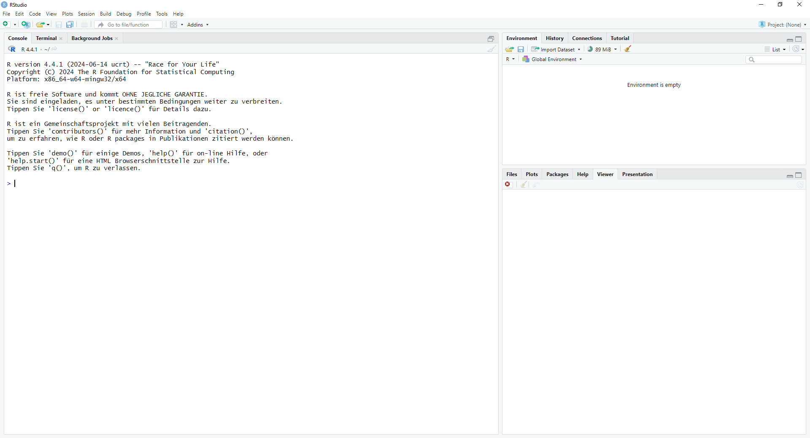
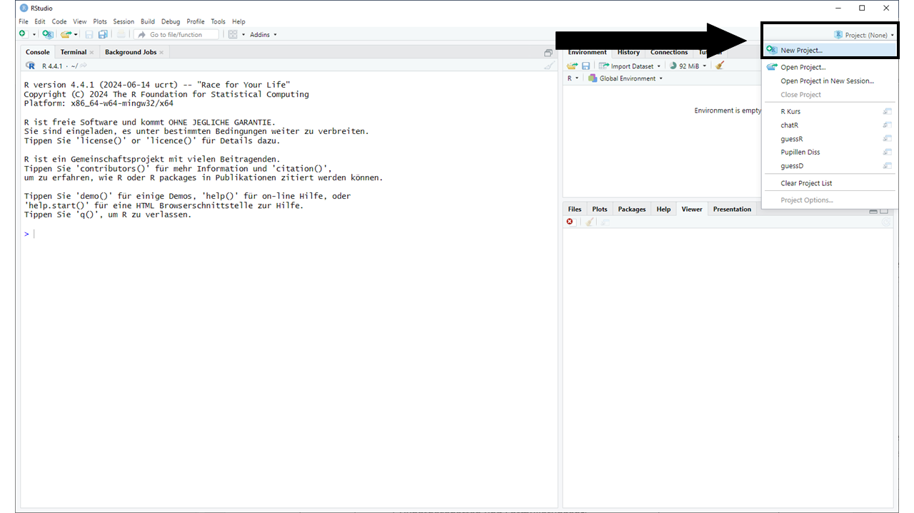
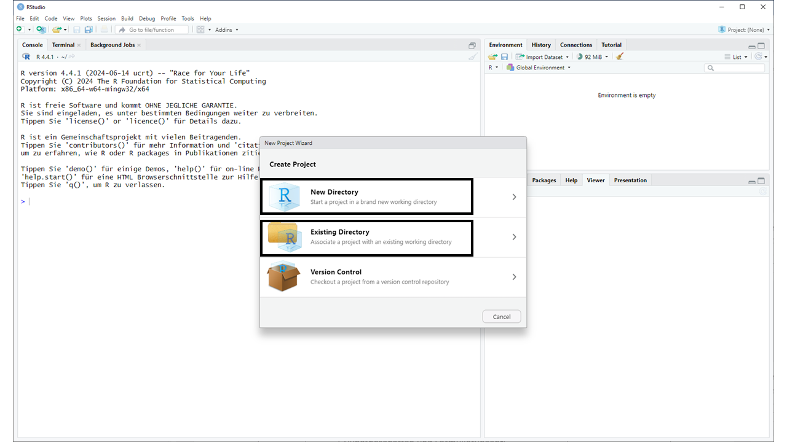
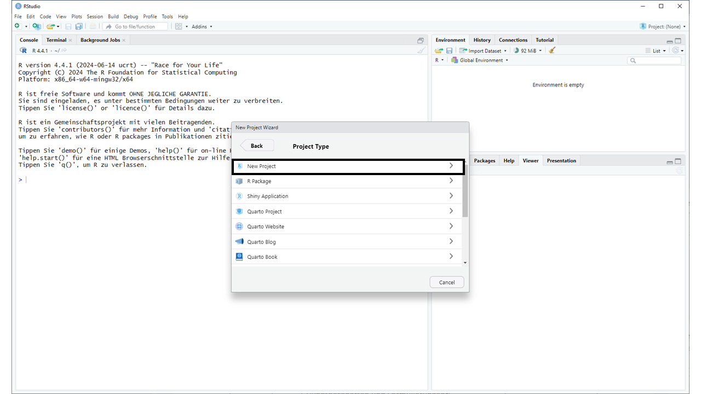
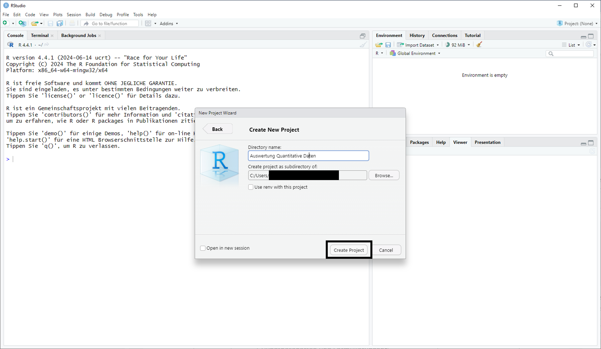

Herzlich willkommen zum Kurs **Auswertung quantitativer Daten**. In den folgenden Wochen werden Sie das statistische Analyseprogramm R kennenlernen. Sie werden dort Daten einlesen, aufbereiten, visualisieren und statistisch auswerten.

Dieses Dokument wird Sie durch die Veranstaltung begleiten. Hier sind alle Inhalte für Sie aufbereitet. Ein Großteil davon in Textform, es gibt aber auch interaktive Elemente und Videos. Jede Woche werden wir ein Kapitel dieses Dokuments behandeln. Die Präsenzsitzungen sind der Übung und Vertiefung der vermittelten Inhalte vorbehalten. Das heißt, dass Sie vorbereitet zu den Sitzungen erscheinen müssen.

## Lernziele

Kommunikationswissenschaft ist nur mit einem bodenständigen Verständnis von Daten und Statistik möglich. Das gilt einerseits für die Forschung, die selbst quantitativ sein kann, mindestens aber voraussetzt, quantitative Studien lesen und verstehen zu können. Es gilt andererseits aber auch für die Berufspraxis: Viele Berufe erfordern heute ein gutes Verständnis von Daten oder sogar einen sicheren Umgang damit.

Vor diesem Hintergrund verfolgt diese Veranstaltung zwei zentrale Ziele:

1.  Wir wollen Ihnen die statistischen Grundlagen vermitteln, die Sie im weiteren Verlauf Ihres Studiums benötigen werden, zum Beispiel in der Veranstaltung „Erhebung quantitativer Daten“, möglicherweise aber auch in der PSP oder einem anschließenden Masterstudium.

2.  Wir wollen Ihnen die Werkzeuge an die Hand geben, die Sie benötigen, um vielfältige Arbeiten mit Daten auszuüben. Konkret bedeutet das, dass Sie lernen, Daten computergestützt aufzubereiten (also in ein verwertbares Format zu bringen), zu beschreiben und zu visualisieren. Dazu werden wir R benutzen.

::: callout-note
## Was ist R?

R ist ein Open-Source-Programm, das heißt, Sie können es kostenfrei nutzen. R zeichnet sich durch eine sehr aktive Community aus, die zahlreiche, ebenfalls kostenfreie, Erweiterungen entwickelt hat. In R nennen wir diese Erweiterungen **Pakete**. Einige davon werden wir im Lauf der Veranstaltung kennenlernen. R ist aber auch eine Programmiersprache mit einem Schwerpunkt auf statistisches Programmieren. Aber keine Sorge: Sie benötigen für diesen Kurs weder Vorkenntnisse in Statistik noch Informatik. Die wichtigsten Grundlagen bringen wir Ihnen bei. Weniger bedrohlich könnte man auch sagen, dass R einfach ein sehr guter und umfangreicher Taschenrechner ist.
:::

## Ablauf und Aufbau des Kurses

Der Kurs ist so konzipiert, dass Sie die Inhalte zwischen den Präsenzsitzungen selbstständig erarbeiten. Die Sitzungen werden wir dann nutzen, um das Erlernte zu üben. Sie sollten also gut vorbereitet kommen! Als Grundlage dazu dient dieses Dokument. Jedes Kapitel erläutert die Inhalte einer Woche.

In den ersten Sitzungen werden wir uns Zeit für die Grundlagen nehmen, die Sie im Lauf des Semesters immer wieder benötigen werden. Dazu zählen auch einige Grundlagen der Statistik. In den späteren Sitzungen werden wir uns dann mit konkreten statistischen Verfahren beschäftigen. Auch hier werden wir uns sowohl mit der Statistik an sich beschäftigen, als auch mit der Umsetzung in R.

Nachfolgendend finden Sie einen tabellarischen Ablauf der Sitzungen.

+------------+--------------------------------------------------------------------------------------------------------+--------------+
| Datum      | Inhalt                                                                                                 | Vorbereitung |
+============+========================================================================================================+==============+
| 13./14.10. | -   Lernziele                                                                                          | \-           |
|            | -   Ablauf und Aufbau des Kurses                                                                       |              |
|            | -   R und RStudio installieren                                                                         |              |
|            | -   Projekt anlegen                                                                                    |              |
|            | -   Skript anlegen und speichern                                                                       |              |
+------------+--------------------------------------------------------------------------------------------------------+--------------+
| 20./21.10. | -   Objekte (Objekte deklarieren, Objekte benennen, Objekttypen)                                       | Kapitel 2    |
|            | -   Datensätze (Daten erstellen, Objekte in Datensätzen ansprechen, Daten einlesen)                    |              |
|            | -   Funktionen (Argumente und Rückgabe von Funktionen, Funktionen ausführen, Funktionen verschachteln) |              |
+------------+--------------------------------------------------------------------------------------------------------+--------------+
| 27./28.10. | -   Pakete installieren und Pakete laden                                                               | Kapitel 3    |
|            | -   Datentransformation                                                                                |              |
+------------+--------------------------------------------------------------------------------------------------------+--------------+
| 03./04.11. | -   Skalenniveaus und zenrtale Lagemaße                                                                | Kapitel 4    |
|            | -   deskriptive Datenanylse                                                                            |              |
+------------+--------------------------------------------------------------------------------------------------------+--------------+
| 10./11.11. | -   Hypothesen (Alternativ- und Nullhypothese, Arten von Hypothesen)                                   | Kapitel 5    |
|            | -   Testtheorie (p-Werte, statistische Signifikanz, statistische Power)                                |              |
+------------+--------------------------------------------------------------------------------------------------------+--------------+
| 17./18.11. | -   Zusammenhänge zwischen zwei nominalen Variablen testen (Kreuztabellen)                             | Kapitel 6    |
+------------+--------------------------------------------------------------------------------------------------------+--------------+
| 24./25.11. | -   Zusammenhänge zwischen metrischen oder ordinalen Daten testen (Korrelationen)                      | Kapitel 7    |
+------------+--------------------------------------------------------------------------------------------------------+--------------+
| 01./02.12. | -   Regressionen I                                                                                     | Kapitel 8    |
+------------+--------------------------------------------------------------------------------------------------------+--------------+
| 08./09.12. | -   Regressionen II                                                                                    | Kapitel 9    |
+------------+--------------------------------------------------------------------------------------------------------+--------------+
| 15./16.12. | **voraussichtlich kein Seminar**                                                                       |              |
+------------+--------------------------------------------------------------------------------------------------------+--------------+
| 22./23.12. | 🎅 **kein Seminar**                                                                                    |              |
+------------+--------------------------------------------------------------------------------------------------------+--------------+
| 29./30.12. | 🎆**kein Seminar**                                                                                     |              |
+------------+--------------------------------------------------------------------------------------------------------+--------------+
| 05./06.01. | -   t-Tests                                                                                            | Kapitel 10   |
+------------+--------------------------------------------------------------------------------------------------------+--------------+
| 12./13.01. | -   Varianzanalysen                                                                                    | Kapitel 11   |
|            |                                                                                                        |              |
|            | -   keine Präsenz; Übungsaufgaben + Online-Sprechstunde nach Bedarf                                    |              |
+------------+--------------------------------------------------------------------------------------------------------+--------------+
| 19./20.01. | -   Reliabilität                                                                                       | Kapitel 12   |
+------------+--------------------------------------------------------------------------------------------------------+--------------+
| 26./27.01. | -   Recap                                                                                              | Kapitel 13   |
|            |                                                                                                        |              |
|            | -   Übungen                                                                                            |              |
+------------+--------------------------------------------------------------------------------------------------------+--------------+
| 02./03.02. | Abschlusssitzung                                                                                       |              |
+------------+--------------------------------------------------------------------------------------------------------+--------------+

## R herunterladen

Bevor es losgehen kann, müssen Sie R auf Ihrem Laptop installieren. Die beste Anlaufstelle dafür ist CRAN (The Comprehensive R Archive Network): <https://cran.r-project.org/>\
Oben mittig auf der Seite können Sie Ihr Betriebssystem auswählen.

-   Wenn Sie Windows nutzen, klicken Sie auf "base" und starten dann auf der nächsten Seite den Download.
-   Wenn Sie macOS nutzen, müssen Sie darauf achten, die für Ihr System korrekte R-Version herunterzuladen.

Nachdem Sie R heruntergeladen und installiert haben, könnten Sie im Prinzip loslegen. Allerdings ist die Nutzeroberfläche von R nicht gerade leicht verständlich. Darum arbeiten wir in diesem Kurs mit RStudio. Hierbei handelt es sich um eine sogenannte integrierte Entwicklungsumgebung, die das Arbeiten mit R deutlich leichter macht. Sie können es auf <https://posit.co/download/rstudio-desktop/> herunterladen. Wählen Sie auch hier die für Ihr Betriebssystem vorgegebene Version herunter und installieren Sie diese.

## In RStudio arbeiten

### Die Nutzeroberfläche von RStudio

Wenn Sie auch RStudio installiert haben, kann es endlich losgehen. Wenn Sie das Programm das erste Mal öffnen, werden Sie gefragt, welche R-Version genutzt werden soll. Hier können Sie angeben, dass die System-Standardversion genutzt werden soll. Das bedeutet auch: Immer wenn Sie RStudio öffnen, wird R im Hintergrund ebenfalls gestartet. Sie müssen also nicht beide Programme öffnen!

Anschließend sollte Ihr Programm in etwa so aussehen wie auf dem Screenshot unten.

{fig-alt="RStudio nach dem erstmaligen öffnen"}

Links sehen Sie die **Konsole**. Hier zeigt R Ihnen, welche Befehle ausgeführt wurden und was das Ergebnis ist. Sie können auch direkt Befehle eingeben, aber dazu unten mehr. Oben rechts sehen Sie das sogenannte **Environment**. Hier finden Sie **Objekte**, die Sie angelegt haben. Ein Objekt kann erst mal alles Mögliche sein, z. B. ein Datensatz, eine Variable oder eine Funktion. Im Lauf des Kurses werden wir darauf noch genauer eingehen. Das Feld unten rechts erfüllt mehrere Funktionen. Die zwei wichtigsten verbergen sich hinter den Reitern **Plots** und **Help**. Die Namen sind relativ selbsterklärend: Unter Plots werden uns Grafiken gezeigt, die wir in R erstellen, und unter Help finden wir Hilfe. Beides ist im Moment noch nicht relevant für uns, aber wir werden später darauf zurückkommen.

### Die Konsole

Zunächst schauen wir uns die Konsole etwas genauer an. Hier können Sie direkt mit R interagieren. Durch das **Größer-als-Zeichen (`>`)** am Anfang der untersten Zeile signalisiert R Ihnen, dass Sie Befehle ausführen können. Wenn Sie z. B. einfache Rechnungen in der Konsole eingeben und mit Enter bestätigen, wird R Ihnen das Ergebnis ausgeben. Die `[1]` können Sie zunächst ignorieren. Dazu kommen wir später noch. Daneben sollte nun das Ergebnis der Rechnung stehen, so wie in den folgenden Zeilen:

```{r}
3+2 
```

Es kann vorkommen, dass Sie in der untersten Zeile der Konsole nicht das Größer-als-Zeichen sehen, sondern ein **Plus**. Das passiert immer dann, wenn Sie einen unvollständigen Befehl ausführen wollen. Geben Sie z. B. nur *17-* ein und versuchen, den Befehl auszuführen, wird R Ihnen ein "+" anzeigen, da es nicht weiß, was von 17 abgezogen werden soll. Sobald Sie eine zweite Zahl eingeben und mit Enter bestätigen, wird Ihnen das Ergebnis angezeigt. Wenn Sie das "+" einmal sehen, aber nicht wissen, woher es kommt bzw. welcher Befehl unvollständig war, können Sie einfach irgendetwas in die Konsole eingeben, mit Enter bestätigen und sich dann auf die Suche nach dem Fehler machen.

Mit diesem Wissen könnten wir so ziemlich alle Funktionalitäten von R nutzen, es wäre aber ziemlich unpraktisch. Zwar speichert R den Verlauf unserer Sitzung (verborgen hinter dem Reiter **History**, oben rechts neben Environment"), das Format ist aber nicht sonderlich gut dazu geeignet, unsere Berechnungen und Analysen wiederverwertbar festzuhalten.

### Arbeit in Projekten

Eine gute Möglichkeit, Ihre Arbeit in R festzuhalten, sind **Projekte**. Diese haben den Vorteil, dass alle relevanten Dateien an einem Ort gebündelt und durch eine spezielle R-Datei verbunden werden. Das macht zum Beispiel das Laden von Datensätzen deutlich einfacher. Als Erstes sollten Sie daher ein Projekt für diesen Kurs anlegen.

Dazu klicken Sie zunächst rechts oben auf "Projekte" und dann "Neues Projekt"



Als Nächstes werden Sie gefragt, ob Sie einen neuen Ordner anlegen oder vorhandenen Ordner verwenden möchten. Falls Sie noch keinen Ordner für diesen Kurs angelegt haben, wählen Sie die erste Option, andernfalls die zweite.



Sofern Sie einen neuen Ordner angelegt haben, klicken Sie nun auf "Neues Projekt".



Zuletzt müssen Sie dem Ordner noch einen Namen geben und angeben, wo er angelegt werden soll und abschließend das Projekt anlegen.

{width="1920"}

### Skripte

**Skripte** sind Dateien, in denen Sie R-Code schreiben und speichern können. Der große Vorteil daran ist, dass Sie Ihre Arbeit so dokumentieren und jederzeit wiederholen oder verändern können, ohne alles von vorne in der Konsole eingeben zu müssen. Um ein Skript anzulegen, klicken Sie oben links auf **File –\> New File –\> R Script**. Nun öffnet sich über der Konsole das (noch leere) Skript. Speichern Sie es am besten direkt ab, entweder über die Menüleiste (**File –\> Save**) oder wie in anderen Programmen per Tastatur:  + . Praktischerweise schlägt R direkt den Ordner vor, in dem wir gerade arbeiten, sprich den vorhin angelegten Projektordner.

Im Skript können Sie nun R-Code schreiben. Um eine Code-Zeile auszuführen, können Sie entweder gleichzeitig  +  drücken, oder oben rechts direkt über dem Skript auf "Run" klicken. R führt den Befehl in der aktuellen Zeile aus und springt zum nächsten Befehl. Manchmal erstrecken sich Befehle über mehrere Zeilen, aber das ist kein Problem. R ist ziemlich gut darin, zu erkennen, wann ein Befehl aufhört und wo der nächste beginnt. Zumindest solange Sie keinen Fehler in Ihrem Code haben.

Das Ergebnis wird Ihnen in der Konsole angezeigt. Probieren Sie es doch mal mit der Addition von oben aus: `3+2`

Damit Sie zukünftig in Ihren Skripten nicht den Überblick verlieren, sollten Sie sich angewöhnen, **Kommentare** zu schreiben. Dazu können Sie das Hashtag- bzw. Doppelkreuzzeichen \`#\` verwenden. Alles was in einer Zeile hinter diesem Zeichen steht, wird von R nicht interpretiert, sondern dient lediglich Ihnen und allen anderen, die den Code lesen, als Erklärung oder Erinnerungsstütze. Jetzt am Anfang mag das noch etwas albern wirken, aber unterschätzen Sie nicht, wie wertvoll es sein kann, nach einer längeren Pause an einem Skript eine gute Dokumentation vorzufinden!

Ab der kommenden Woche werden wir intensiv(er) in Skripten arbeiten. Die ersten Kapitel können Sie noch gut in einem Skript bearbeiten. Für die späteren Kapitel empfiehlt es sich, jeweils ein neues Skirpt anzulegen, damit Sie den Überblick nicht verlieren.

## Ressourcen

R ist sehr komplex und kann nicht innerhalb eines Semesters gemeistert werden. Wie oben erwähnt, lernen Sie in dieser Veranstaltung einige wichtige Grundlagen. Die ersten davon haben Sie heute schon gelernt. Dennoch werden Sie in den nächsten Wochen und Monaten einiges an Informationen verarbeiten müssen. Ihre erste Anlaufstelle dafür ist dieses Dokument und die Präsenzübungen. Aber niemand nimmt es Ihnen übel, wenn Sie darüber hinaus weitere Hilfe benötigen oder in Anspruch nehmen!

Die meisten Probleme, die Sie haben werden, hatten vor Ihnen schon unzählige andere R-Lerner:innen und glücklicherweise hat R eine sehr aktive und hilfsbereite Community, die Ihnen jederzeit weiterhelfen kann. Beispielsweise finden sich in einigen sozialen Netzwerken wie **X/Twitter** oder **Bluesky** (#rstats) und **Reddit** (/r/rstats) informelle R-Gruppen, die einander Fragen beantworten. Wenn Sie ein Problem oder eine Fehlermeldung googeln, werden Sie früher oder später auch Ergebnisse von **StackOverflow** finden, einem Forum für Programmierer:innen. Und keine Sorgen: Niemand erwartet von Ihnen, dass Sie sich aktiv in die Community einbringen!

Darüber hinaus gibt es zahlreiche Lehrbücher und Online-Kurse über R. Untenstehend finden Sie einige davon:

-   [R für Einsteiger](https://www.beltz.de/fachmedien/psychologie/produkte/details/43910-r-fuer-einsteiger.html) von Maike Luhmann (Zugriff über das Uninetz)
-   [Learning Statistics with R](https://learningstatisticswithr.com/) von Danielle Navarro
-   Eine Sammlung [Häufig verwendeter Datenvisualisierungen](https://r-statistics.co/Top50-Ggplot2-Visualizations-MasterList-R-Code.html?utm_content=cmp-true)
-   Ähnlicher R-Kurs aus [Hamburg](https://xvariable.github.io/r_book/)

Falls Sie in diesen Quellen nicht fündig werden, spricht prinzipiell auch nichts gegen den Einsatz von **KI**, also zum Beispiel große Sprachmodelle wie **ChatGPT**. Hiermit erhalten Sie ganz offiziell die Erlaubnis, davon im Rahmen dieses Kurses Gebrauch zu machen! Seien Sie bitte trotzdem vorsichtig: Nicht jeder von ChatGPT und ähnlichen Anwendungen erstellte R-Code tut das, was Sie wollen oder sich vorgestellt haben. Prüfen Sie den Code daher stets auf Herz und Nieren, bevor Sie ihn als richtig akzeptieren.
